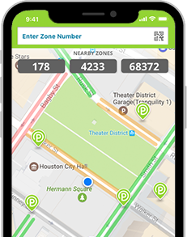
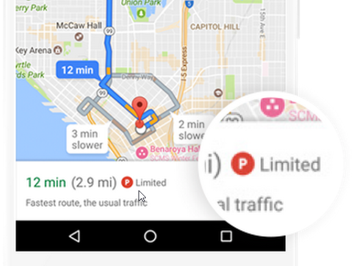
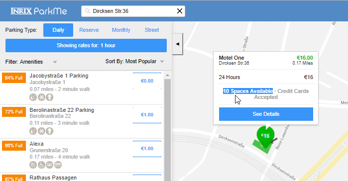
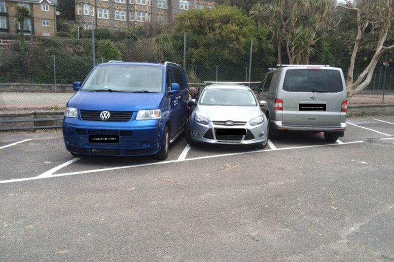

It’s been a week since our regular hackathon at Parkmobile and it's a good time to recap and share key takeaways. The aim of the hackathon was to find innovative solutions that improve the life of drivers dealing with the parking challenges. I teamed up with a few like-minded people and we focused on Parking Availability challenge. Here I am going to deep-dive into the availability problem and share our findings.

### The challenge

> As a customer I want to search for parking in a specific area and get insight if there are spaces available? So show our customers parking prediction per street/area using our transaction history.

### Naive approach

The first reaction was, not surprisingly ... Machine Learning. And here we go: people started to argue whether it should be TensorFlow or AWS SageMaker, should we use the data from Amsterdam or from Paris, how accurate must be the prediction and so on and so forth. People that know absolutely nothing about the data science or machine learning, those suddenly turned into cool experts and with the very smart face tried to show off their intelligence. Tell you what, the Machine Learning is as useless here as a blockchain. Never start from technology!

### Right approach

We returned back to the drawing board. This time we focus on the most important thing: **what** we are trying to solve, rather than **how**. And immediately an excellent question popped up: are we reinventing the wheel, i.e. is there already existing solution on a market? The research shows three main approaches to the availability problem:

- Heatmap with colors indicating the occupancy on the street level. For example Parkmobile US:

- Indication of how busy is the area, like Google Maps:

- Exact number showing the available parking spots, like ParkMe:

We quickly figured out that these existing approaches are not solving the **availabilty** problem as we see it. They rather give you an insight on what's going on. But the problem is:

> Whether or not I can park (taking into account my personal situation)

You see it, right? It's different whether you drive luxurious 5 meter long BMW 5 Series vs Mini One. It does matter whether you are experienced driver or a rookie. Are you a woman with small children(s)? Then perhaps you do not want to park in 15 minutes walking distance. Are you a student? Most likely you do not mind to park cheap outside of the center and walk 15-20 minutes. 

None of existing solutions take your personal situation into account. And none of them answers whether or not you can park. All you see is a number or load distribution and this is not enough. You do not think so? What if the parking lot is vacant, but it is too narrow to park there.

What if the parking lot is technically free, but far away from desired location? And it's freaking cold, and raining/snowing? Are you sure that you still do not mind walking? It depends right? For some people it's still ok, for some not. Proper solution must take the user's preferences into account as well as collect user feedbacks. Was it easy to find parking lot here? Was it convenient to park here or you would rather park somewhere else? 