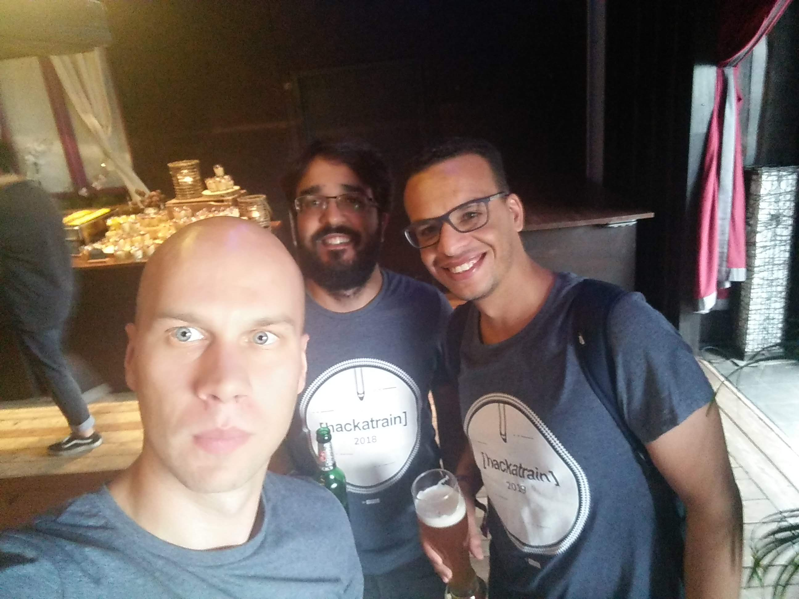
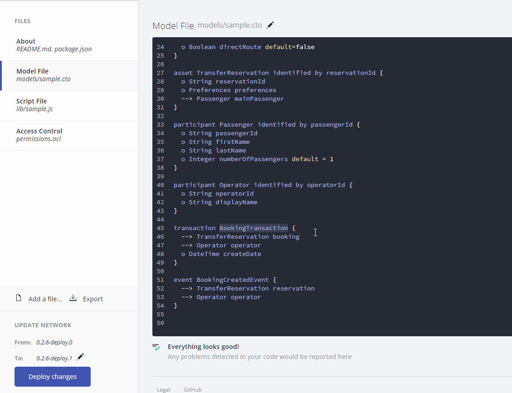

## Intro

How about having a hackathon in the train? 6 hours in the train, without internet, going with the speed over 180 km/h. Sounds crazy, but rather cool, isn't it? Consider high-speed train heading to Berlin with 100+ participants spread over two train wagons. Here at [Parkmobile](https://parkmobile.nl), we like cool things and the spirit of innovation, needless to say I am in!

## Diving deeper

You probably think that hackathon looked like this:

Yeah right, I wish. The beers will come later. First get you hands dirty:

There were 14 teams with 6 participants in each team. A team contains a few software developers (usually 2-3), scientists and 1-2 students (comletely non-IT folks). For example, there were two students of Theatre and Performance Studies in my team. There are also people outside of the teams: coaches, mentors and supporting staff. Time is very limited and you start conding only in the evening of Day 1 (certainly after dinner and a few beers) while pitches start at 2:00 PM on the Day 2. The winning team gets 5, 000 euro gross.

Parkmobile mates

## Lessons learned

There are a few key points I took away from this event. There are actually a lot more of them, but here I list crucial only:  

* [Parkmobile](https://parkmobile.nl) is a great company! Ahaha, now seriously. Having talked to the other participants (huh, competitors!) I clearly see that [Parkmobile](https://parkmobile.nl) invests much more into innovation and technical development of our people. Perhaps because we are a part of BMW Group. Or, let's be honest, that's why we are a part of BMW Group.

* Acceptance criteria. Ask how jury is going to choose the winner. We were all surprised with the choice. Even the winners...
* Communication. People like to talk and they do talk a lot, a lot more than needed. Absolutely not listening nor analyzing what others just have said. And they try to make a ~~useless~~ point and then they try to prove their point. And you have to learn how to stop those useless discussions and wasting the time and instead keep the team's focus on the challenge. That is the best what you gain from the hackathons
* Time management. Oh how many participants I've seen in panic mode on the Day 2, especially closer to the pitch time. Finally they realize how much time they wasted for nothing. The hackathon is a great excercise that builds a discipline
* Teamwork. Don't do the same mistake when you want to sit alone doing **your part**. You will end up with typical problem: your part works pretty well, however whole solution does not work at all.
* Energy and drive. Every team needs someone energetic and proactive. The team is loosing willingness to win as soon as they encounter issues. Form the team in such a way that you have at least one **energetic doer**. Someone who pushes forward and does not give up.

## Challenge

The challenge was kept in a secret till the very last moment, before we get into the train.

> You are going to the concert that ends at the late night. Develop the solution by utilizing Mobility-As-A-Service, 3rd party API and Blockchain to help the users to return home in time and according to their preferences.

The solution is not a big deal. The 3rd party API are well specified, we've got the specs from 9292, NS train ad Parkmobile. This covers all the transport and logistics from train and buses to the cars and even parking lots. The main problem was a blockchain. What are you going to use it for??

IBM Hyperledger modeling

## Day 1

We gathered at Amsterdam Central Station at 8:30 AM, had a little breakfast and coffee and meet our teams. A few minutes for  socialization and we are ready to get into the train.

Train is full. Berlin, here we come!

That was quite warm weather and it was incredibly hot inside the train. We had to change our sweaty T-shirts every now and then.

Finally the team sits together and we begin brainstorming.

At that moment, the main challenge was to stay together and follow the discussion. A lot of people constantly passing nearby distracts you. As well as the noise produced by all of us.

## Day 2
