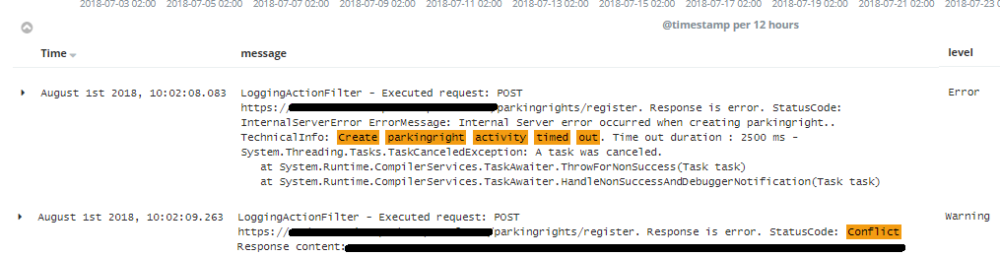
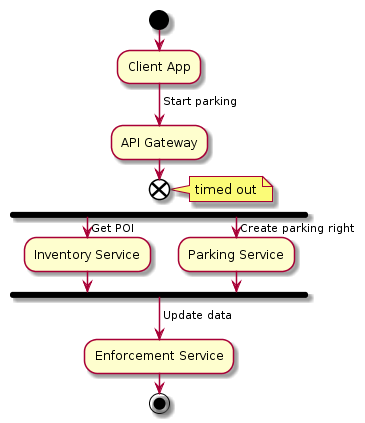

 The timeout pattern is perhaps the most basic way to reveal performance issues and satisfy the SLA. Even though the request did not succeed, the client gets the response within a defined SLA time span and the request can be retried. It sounds easy to implement as well. Simply set the timeout in the service client, i.e. RestClient, HttpWebRequest, or HttpClient. That is where it gets a bit tricky.

Here is the excerpt from Kibana logs of the real-world production microservice. An attempt to create parking action has timed out and the caller received an error response with a 500 HTTP status code. Then the caller retried and received the error again, this time the response with 409 HTTP status code, saying that the item already exists.



The following diagram illustrates the high-level process:



And this is a piece of code in API Gateway causing the problem:

```csharp
httpClient.Timeout = TimeSpan.FromMilliseconds(timeout);
var response = await httpClient.SendAsync(request);
```

Even though the request has timed out, the parking action is still being persisted. Look what happened. The API Gateway aborted the request to the Parking service once the timeout was exceeded, but it did not cancel it. At that moment the Parking service was waiting for the database operation to complete. You are totally right if you thought of what is known as Compensating Transaction pattern. And to make it right, we have to inform the Parking service that the operation was canceled and we should stop processing and roll back all the actions performed (if any). And here the CancellationToken comes into play.

This is what you would change at the API Gateway:

```csharp
var tokenSource = CancellationTokenSource.CreateLinkedTokenSource(cancellationToken);
tokenSource.CancelAfter(timeout);
var response = await httpClient.SendAsync(request, tokenSource.Token);
```

And the changes on the Parking service. First, we modify the controller to accept the cancellation token:

```csharp
 public async Task<IHttpActionResult> StartParking(StartParkingRequest request, CancellationToken cancellationToken)
{
    cancellationToken.ThrowIfCancellationRequested();
    var parking = parkingRequestConverter.ToParkingEntity(request);
    var parkingId = await parkingRepository.Insert(parking, cancellationToken);
    ...
}
```

Finally, the repository is adjusted as follows:

```csharp
public async Task<T> Insert<T>(IModel model, object param, CancellationToken cancellationToken)
{
    T result;
    using (var connection = CreateSqlConnection())
    {
        using (var transaction = connection.BeginTransaction())
        {
            //NOTE: we can not use DapperExtensions as it does not support a cancellation
            var sql = _sqlGenerator.GetInsertCommandText(model);
            var command = new CommandDefinition(sql, param, transaction, cancellationToken);
            result = await connection.ExecuteScalarAsync<T>(command);
            if(!cancellationToken.IsCancellationRequested)
                transaction.Commit();
        }
    }
    return result;
}
```

Now, whenever the timeout is exceeded, the request is canceled, propagating the cancellation from API Gateway to the Parking service, so that the service cancels the activity accordingly. This reduces the number of errors, which in turn simplifies troubleshooting and provides consistent results.

To recap: we've created a linked token source with custom timeout and propagated its cancellation token all the way to the downstream service and database layer. 
